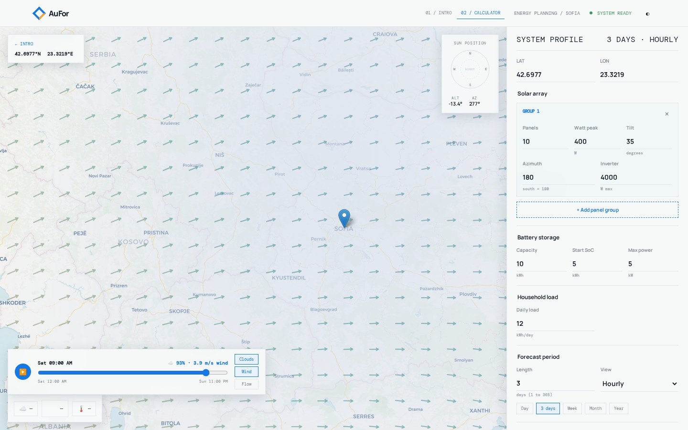
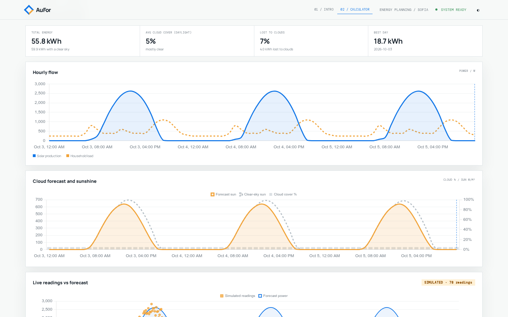
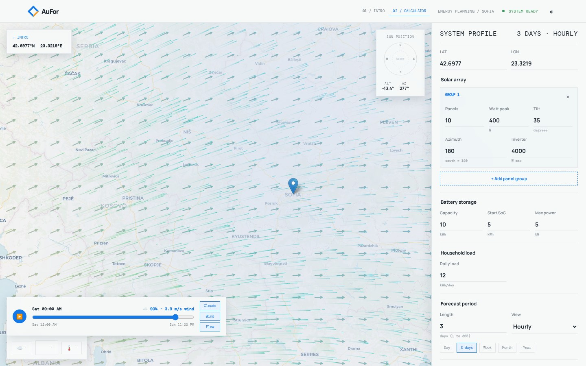
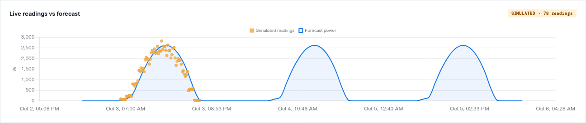
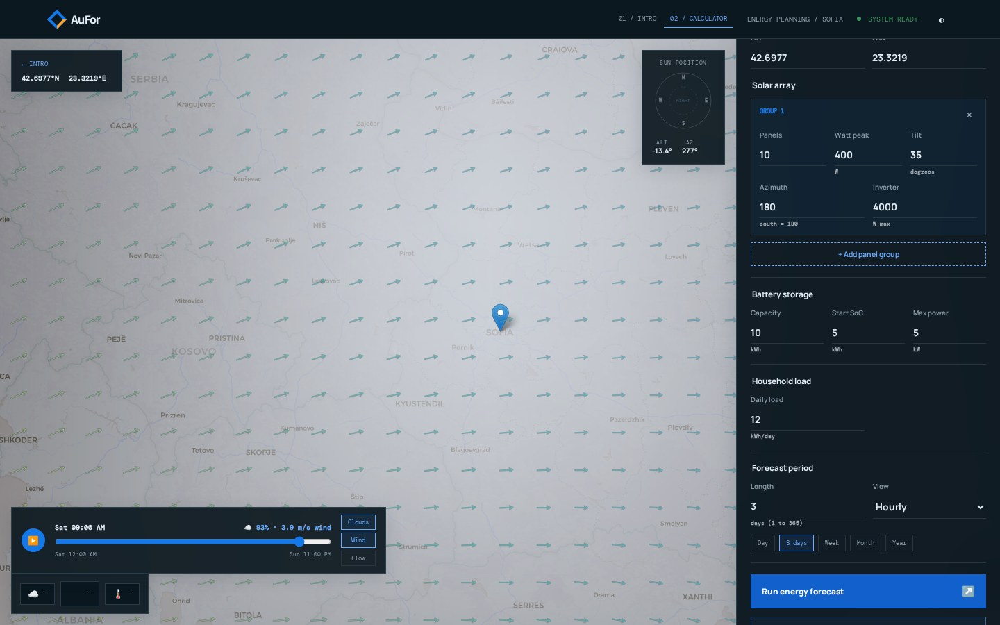
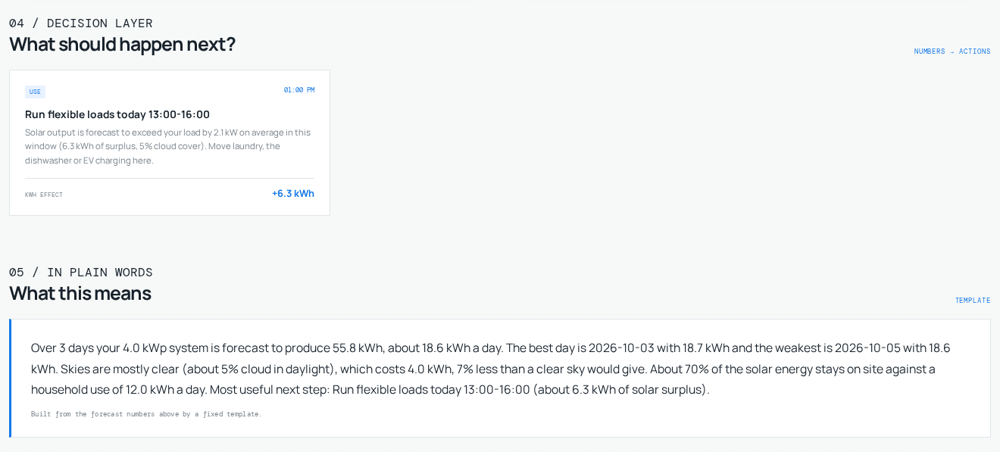
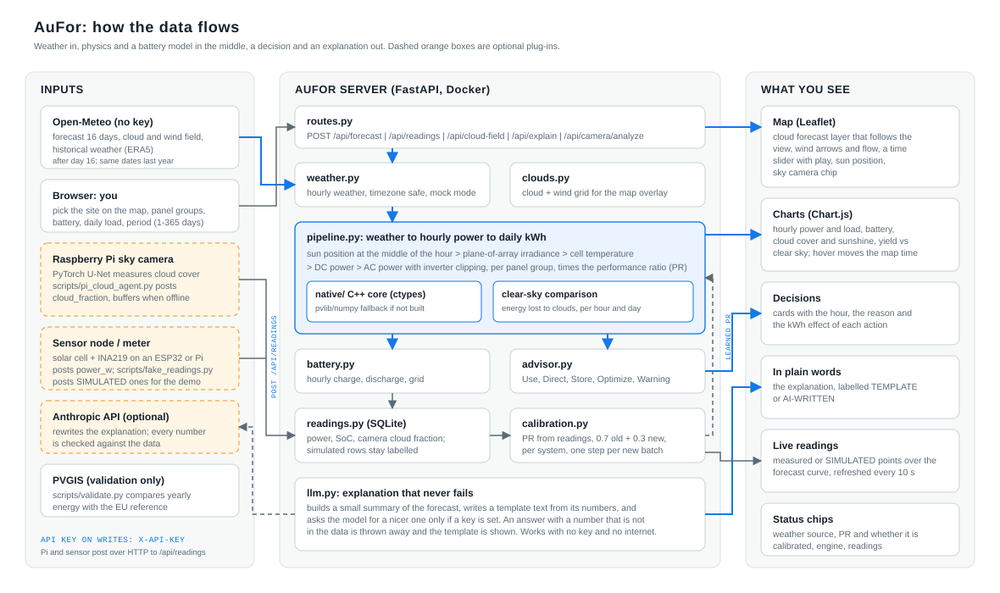

# AuFor

**Plan your solar energy before it arrives.** AuFor forecasts how much electricity your solar panels will
produce (hours to a year ahead), simulates your battery, and tells you **when to use, store or save energy**. It
turns the weather forecast into a number *and a decision*, and it gets more accurate the more real data you connect.

Built for the ATANASOFF\_\_48 hackathon (theme: *Energy around us*; subtopics Use / Direct / Optimize / Store).



## What it does

| | |
|---|---|
| **Forecast** | Hourly AC power, daily and monthly kWh for any period from 1 to 365 days. Several panel groups with their own tilt, azimuth and inverter. |
| **Weather that matters** | Cloud cover, temperature and wind from Open-Meteo, shown next to what a clear sky would give, so you see **how much energy clouds cost** (hour by hour). |
| **Cloud and wind map** | A forecast layer that follows the map view: clouds, wind arrows and animated flow, with a time slider (play it forward 16 days). Hovering a chart moves the map in time. |
| **Battery** | Hourly charge, discharge and grid import or export, with depth of discharge, efficiencies and a power limit. |
| **Decisions** | Rule-based cards, each with the hour, the reason and the kWh effect: **Use** (best surplus window), **Store** (weak tomorrow), **Direct** (battery full before noon), **Optimize** (better tilt or azimuth), **Warning** (cloud dip in the peak hours). |
| **Plain-language explanation** | Always a template written from the numbers; optionally rewritten by an LLM, which may only use numbers from the data (anything else is thrown away). |
| **More data, more accuracy** | Real power readings (a sensor, a meter) calibrate the performance ratio. A sky camera on a Raspberry Pi can post live cloud cover. |
| **Honest by design** | Mock weather, simulated readings and calibrations on simulated data are always labelled. No accuracy is claimed that was not measured. |

<p>

</p>

## Quick start

### With Docker (recommended)

```bash
docker compose up --build
```

Open <http://127.0.0.1:8000>. The image compiles the C++ solar core inside the build, so it needs only Docker.
The `data/` folder is mounted for the readings database. Settings come from `.env` if it exists.

### Locally

Python 3.11 or newer (developed on 3.14, the Docker image uses 3.11):

```bash
python -m venv .venv && source .venv/bin/activate
pip install -r requirements.txt
cp .env.example .env              # optional: add a map key, an LLM key, ...
bash native/build.sh              # builds the C++ core; needs g++. Optional, see below
uvicorn main:app --reload
```

Open <http://127.0.0.1:8000> (intro) and <http://127.0.0.1:8000/calculator> (the app).

* **No C++ compiler?** The app still works. It falls back to a pure Python implementation of the same physics
  (the "Physics engine" chip says `PYTHON FALLBACK`). Only the *Optimize* rule needs the C++ library.
* **No internet?** Run with `USE_MOCK_WEATHER=1`. The bundled clear-day weather is used and labelled `MOCK (SIMULATED)`.
  The page itself loads Leaflet, Chart.js and fonts from CDNs, so the browser needs internet for those.
* **Tests:** `pytest -q` (offline, about 250 tests, 15 seconds).

### A five-minute demo

1. Open `/calculator`, press **Run energy forecast**. Scroll down: energy, cloud loss, charts, decision cards, explanation.
2. Press **play** on the map timeline and switch on **Wind** and **Flow**. Move the mouse over a chart.
3. Run `python scripts/fake_readings.py` (some daylight hours of today must already be over). The *Live readings* chart fills with SIMULATED points, and the next forecast
   shows `CALIBRATED · PR 0.78 · SIMULATED DATA`. Run it again with `--step-minutes 5` and the PR moves closer to the
   fake system's true 0.736. `--reset` starts over.
4. Run `python scripts/pi_cloud_agent.py --free-percent 9.1 --once`: a camera reading arrives and the map shows
   `📷 91% cloud`.

## Screenshots

Taken with the bundled mock weather (the page labels it `MOCK (SIMULATED)`) and simulated readings, so they are
reproducible. Regenerate them with `python scripts/make_screenshots.py` (add `--mock` to work offline; it needs Playwright).

| | |
|---|---|
|  |  |
|  |  |



## How it works



1. **Weather** (`app/weather.py`): Open-Meteo hourly irradiance, temperature, cloud and wind, timezone-safe. Open-Meteo
   forecasts 16 days; for longer periods the remaining days use **the same dates of the previous year** (a climate
   average, labelled as such).
2. **Physics** (`native/` C++17 core through `ctypes`, `app/solar_python.py` as fallback and test oracle): sun position
   at the middle of each hour, plane-of-array irradiance, cell temperature (NOCT), DC power, AC power with
   per-inverter clipping, times the performance ratio (PR, default 0.80). The two engines agree to rounding error.
3. **Clouds** (`app/pipeline.py`): the same system under a clear sky gives the comparison; the difference is the energy
   lost to clouds.
4. **Battery** (`app/battery.py`): greedy self-consumption, hourly, with state-of-charge limits.
5. **Decisions** (`app/advisor.py`): five rules, thresholds in `app/config.py`, every sentence built from the data.
6. **Calibration** (`app/readings.py`, `app/calibration.py`): readings are stored in SQLite; the PR moves one smoothing
   step (0.7 old + 0.3 new) whenever new valid readings arrive. Only daytime, unclipped hours count and at least 12
   readings are needed.
7. **Explanation** (`app/llm.py`): a template text from the numbers; an optional LLM rewrite is accepted only if every
   number in it matches the data.

### Configuration (`.env`)

| Variable | Meaning |
|---|---|
| `USE_MOCK_WEATHER` | `1` = use the bundled clear-day weather, no network |
| `CARTO_API_KEY` | optional key for CARTO map tiles (the public tiles are used without it) |
| `LLM_ENABLED`, `LLM_API_KEY`, `LLM_MODEL` | switch on the AI explanation (Anthropic API). Off by default; the template is used without them |
| `READINGS_API_KEY` | if set, writes to `/api/readings` need the header `X-API-Key` (use it whenever the server is reachable from outside) |
| `DATABASE_PATH` | readings database, default `data/readings.db` |
| `SOLAR_LIB_PATH` | path of a custom `libsolarsight` build |
| `WEATHER_PROVIDER`, `TOMORROW_API_KEY` | reserved for a Tomorrow.io fallback, **not implemented yet** (Open-Meteo is the only provider) |
| `LOG_LEVEL` | `INFO` by default |

### API

| Endpoint | |
|---|---|
| `POST /api/forecast` | system + battery + load + `days` (1-365) + `resolution` (`hourly`, `daily`, `monthly`) |
| `GET /api/cloud-field` | cloud and wind grid for the visible map, up to 16 days |
| `POST /api/readings`, `GET /api/readings`, `GET /api/readings/summary` | plug-in measurements (`power_w`, `soc_kwh`, `cloud_fraction`); simulated rows stay labelled |
| `POST /api/camera/analyze` | measure a sky photo on the server, only if the PyTorch model is installed there (otherwise 501) |
| `POST /api/explain` | the AI explanation for a forecast just made; falls back to the template |
| `GET /api/calibration`, `POST /api/calibration/reset` | the learned performance ratio per system |
| `GET /api/health` | `{"status": "ok"}` |

Interactive docs: `/docs`.

## The sky camera and the sensor node

The cloud model (a PyTorch U-Net, `cloud_predictor.py` and `src/`) is heavy, so it is meant to run **on a Raspberry Pi**
next to the camera, not in the web container. `scripts/pi_cloud_agent.py` takes a photo, measures the cloud cover and posts
`cloud_fraction` to the server. If the server is unreachable it keeps the readings in `pending_readings.jsonl` and sends
them later, oldest first.

```bash
python scripts/pi_cloud_agent.py --server http://SERVER:8000 --api-key SECRET \
    --capture-cmd "rpicam-still -n -t 500 -o {path}" --radius 150 --interval 120
```

It needs torch, OpenCV and the model weights (`checkpoints/best.pth`, not in this repository). Use one radius for every
photo: the same image gave 41% to 57% clear sky for radii between 100 and 220 px. A solar cell with an INA219 on an
ESP32 or Pi can post `power_w` to `/api/readings` the same way (not built yet).

## Validation

`python scripts/validate.py` compares the forecast with baselines and an external source and prints this report
(real run on 2026-10-03, 10 x 400 W, tilt 35 deg, south, Sofia; `--output validation.md` saves it):

* **Clear-sky bound: pass.** The forecast never exceeds a pvlib Ineichen clear sky (x1.05): 0 of 384 real forecast hours,
  highest ratio 0.96. The bound uses clean air (Linke turbidity 2.0) so it is a true upper bound; pvlib's default for Sofia
  (about 3.1) is too dim for that.
* **PVGIS cross-check: pass.** Same system with 2025 Open-Meteo weather against the EU's PVGIS: **5,363 kWh against
  4,969 kWh a year (+7.9%)**, within the 20% target. Specific yield: **1,341 kWh/kWp/year** (PVGIS: 1,242), inside the
  plausible range for Sofia. Single months scatter more: from -17% (October) to +31% (January), because one year of
  weather is compared with a long-term average.
* **Accuracy against measurements: not available.** No real power readings exist yet, so **no accuracy is claimed**.
  Simulated readings are not measurements. The metrics (RMSE, MAE, skill against persistence) are implemented and
  tested, and the script computes them as soon as real readings exist.

## Limitations and what is simulated

* The **mock weather** is an approximate clear day for tests and offline demos, not physics. The **fake readings** come
  from a simulated system with a fixed PR of 0.736 and are labelled `SIMULATED` everywhere.
* The forecast is **not validated against real measured production**. Only the bounds and PVGIS above are checked.
* Beyond 16 days the weather is last year's weather for the same dates: an estimate, not a forecast.
* The cloud and wind map is a **weather-model forecast on a 15 x 9 grid**, not satellite imagery.
* The *Optimize* kWh figure is a clear-sky yearly upper bound, not a prediction.
* Calibration learns the PR of the system configured in the page and assumes the readings come from that system.
* The household load is a typical daily profile scaled to your daily kWh, not a measured one. The battery model has no
  tariffs or grid prices.
* The sky-camera model could not be run in the test environment (no torch, no weights); the agent and the API around it
  are tested with the model replaced by a stand-in.

## Repository

```
app/            FastAPI modules: weather, pipeline, solar (C++ wrapper), battery, advisor, calibration, readings, llm, clouds
native/         C++17 solar core (build.sh) and its header
templates/      the single page (intro and calculator)    static/   app.js and style.css (no build step)
scripts/        validate.py, fake_readings.py, pi_cloud_agent.py, make_screenshots.py
tests/          about 250 offline tests, incl. the end-to-end smoke test
docker/         Dockerfile (docker-compose.yml is in the root)
src/, cloud_predictor.py   the PyTorch sky model (run on the Pi)
docs/           architecture diagram and screenshots
```

## Team

ivchu (server, pipeline, map and integration), vanchu (weather, LLM, networking), momcilchu (camera, hardware, data),
svetlyo (solar physics, baselines).

## License

GNU General Public License v3.0, see `LICENSE`.
